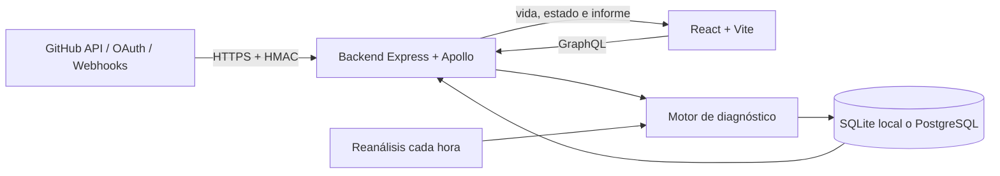

# DevGotchi

DevGotchi es una aplicación monolítica para observar la salud técnica de un repositorio de GitHub mediante una mascota virtual. El frontend React consume el contrato GraphQL del backend Node.js; el backend analiza señales reales del repositorio, calcula un puntaje, persiste el estado y recibe eventos por REST.

## Arquitectura y stack

El repositorio contiene un único producto desplegable y versionado en conjunto:

- `src/`: interfaz React + TypeScript + Vite.
- `backend/src/`: API Express, Apollo Server, GraphQL, REST, OAuth, webhooks y cron.
- `backend/db/`: acceso e inicialización compatible con SQLite y PostgreSQL.
- `.github/workflows/ci.yml`: verificación automática del monolito.
- `docker-compose.yml`: backend dockerizado y PostgreSQL.

Tecnologías: Node.js 22, React, TypeScript, Vite, Express, Apollo Server, GraphQL, PostgreSQL, SQLite, Jest y Vitest.



## Requisitos

- Git.
- Node.js 22 y npm.
- Docker Desktop con Docker Compose para la demostración PostgreSQL.

```bash
node --version
npm --version
docker --version
docker compose version
```

## Demo local con SQLite

La vía más rápida no requiere secretos ni Docker. Desde la raíz:

```bash
npm run install:all
npm run demo
```

El script inicia el backend, espera a que GraphQL responda y luego inicia Vite. Abre `http://127.0.0.1:5173`. SQLite se usa cuando `DB_HOST=localhost` o no se define un host remoto. La base local `devgotchi.db` está ignorada por Git.

Pruebas rápidas:

```bash
curl http://127.0.0.1:3000/health
curl http://127.0.0.1:3000/estado-db
curl -X POST http://127.0.0.1:3000/graphql \
  -H "Content-Type: application/json" \
  -d '{"query":"query { devgotchi { id nombre vida_actual repository_url } }"}'
```

## Backend dockerizado con PostgreSQL

Desde la raíz, opcionalmente copia `.env.example` como `.env` y luego ejecuta:

```bash
docker compose up --build
```

Compose construye `backend/Dockerfile` sobre Node.js 22 Alpine, instala con `npm ci --omit=dev`, espera el healthcheck de PostgreSQL y expone el backend en `http://127.0.0.1:3000`. El backend se conecta al host interno `postgres`, nunca a `localhost`, e inicializa el esquema automáticamente. PostgreSQL y el almacén cifrado OAuth usan volúmenes persistentes.

Comprobación:

```bash
docker compose ps
curl http://127.0.0.1:3000/health
curl http://127.0.0.1:3000/estado-db
docker compose exec postgres psql -U devgotchi -d devgotchi -c "\\dt"
```

Para detener sin borrar datos:

```bash
docker compose down
```

`docker compose down -v` también elimina los volúmenes y debe usarse solo cuando se quiera reiniciar los datos.

## Variables de entorno

No versionar archivos `.env`. Los ejemplos seguros son `.env.example`, `backend/.env.example` y `frontend/.env.example`.

| Variable | Uso |
| --- | --- |
| `PORT` / `BACKEND_PORT` | Puerto interno / publicado del backend. |
| `DB_HOST`, `DB_PORT` | `localhost` activa SQLite; Compose usa `postgres:5432`. |
| `POSTGRES_USER`, `POSTGRES_PASSWORD`, `POSTGRES_DB` | Credenciales locales de PostgreSQL. |
| `FRONTEND_URL` | Origen permitido por CORS. |
| `VITE_GRAPHQL_URL` | Endpoint GraphQL consumido por React. |
| `GITHUB_TOKEN` | Token opcional de solo lectura para repositorios privados y alertas. |
| `GITHUB_CLIENT_ID`, `GITHUB_CLIENT_SECRET`, `GITHUB_CALLBACK_URL` | OAuth App de GitHub. |
| `SESSION_SECRET` | Deriva la clave AES-256-GCM para el almacén de conexiones. |
| `GITHUB_CONNECTION_STORE` | Ruta opcional del almacén cifrado. |
| `GITHUB_WEBHOOK_SECRET`, `GITHUB_WEBHOOK_URL` | Firma HMAC y callback público del webhook. |

## Funcionalidad

### Diagnóstico y motor de salud

Al conectar o actualizar un repositorio, el backend consulta GitHub para detectar tests, configuración de coverage, workflows versionados y ejecuciones recientes, `.gitignore`, archivos `.env` rastreados y señales de seguridad cuando hay permisos. Cada hallazgo produce un estado, impacto y recomendación. El puntaje final de 0 a 100 se convierte en la vida y el ánimo de la mascota. Los resultados se guardan para evitar llamadas innecesarias durante cinco minutos.

El cron ejecuta un reanálisis técnico cada hora (`0 * * * *`) para proyectos activos. No aplica una pérdida arbitraria de vida: vuelve a consultar las señales del repositorio y sincroniza puntaje, ánimo, informe y fecha.

### GraphQL y REST

- GraphQL: `POST /graphql`; consultas de usuarios, proyectos, mascota, actividades, historial y webhooks; mutaciones de conexión, análisis, renombrado y mantenimiento.
- REST: `GET /health`, `GET /estado-db`, `GET /api/projects`, `POST /api/webhooks/project-status`.
- Webhook GitHub: `POST /api/github/webhook`, con validación `X-Hub-Signature-256`, normalización de eventos y deduplicación por delivery.

### OAuth y seguridad

El flujo OAuth usa Authorization Code, `state` firmado, PKCE S256 y cookie `HttpOnly`/`SameSite=Lax`. Solicita `read:user repo:status write:repo_hook`, necesarios para identificar al usuario, leer estados y registrar el webhook. Las credenciales reales nunca son necesarias para tests o demo local. Cuando se conecta un repositorio, access y refresh tokens quedan cifrados con AES-256-GCM en el backend; no se envían al navegador.

## Pruebas y calidad

```bash
# Backend
cd backend
npm ci
npm test
npm run test:coverage

# Frontend
cd ../frontend
npm ci
npm test
npm run lint
npm run typecheck
npm run build

# Verificación completa desde la raíz
cd ..
npm run verify
```

Jest exige globalmente al menos 60% en statements, branches, functions y lines. Las pruebas cubren servicios, resolvers, REST/GraphQL, SQLite/PostgreSQL, cron, OAuth/PKCE, almacenamiento cifrado y validación HMAC. Vitest valida los estados de carga/error, conexión, análisis, renombrado e informe del frontend.

## Integración continua

GitHub Actions se ejecuta en pushes a `main` y pull requests hacia `main`, con Node.js 22 y caché de npm:

- Backend: `npm ci`, auditoría de dependencias de producción, tests y coverage con umbral obligatorio de 60% en las cuatro métricas.
- Frontend: `npm ci`, auditoría de dependencias de producción, tests, lint, type-check y build de producción.

No requiere secretos ni acceso real a GitHub; las integraciones externas se prueban con dobles controlados.

## Cumplimiento de requisitos del proyecto

| Requisito | Evidencia en el repositorio | Comando de verificación |
| --- | --- | --- |
| Arquitectura monolítica | Frontend, backend, DB, CI y documentación en un repositorio | `git ls-files` |
| Frontend y backend identificables | `src/`, `frontend/` (tooling) y `backend/src/` | `npm run demo` |
| GraphQL y REST | Apollo `/graphql`; Express `/health`, `/estado-db`, `/api/*` | consultas `curl` anteriores |
| Backend dockerizado | `backend/Dockerfile`, `backend/.dockerignore` | `docker compose build --no-cache backend` |
| PostgreSQL persistente | `docker-compose.yml`, healthcheck y volumen | `docker compose up --build` |
| SQLite local | Adaptador `node:sqlite` y esquema específico | `npm run demo` + `/estado-db` |
| Coverage mínimo 60% | Umbrales globales Jest en `backend/package.json` | `npm --prefix backend run test:coverage` |
| Tests frontend/backend | Jest + Supertest; Vitest + Testing Library | `npm test` en cada paquete |
| CI | `.github/workflows/ci.yml` | pestaña Actions / lectura del workflow |
| Diagnóstico real | `repositoryHealthService.js` consulta GitHub y emite recomendaciones | tests del servicio y análisis manual |
| Cron de reanálisis | `cronService.js` reanaliza cada hora | tests del cron |
| OAuth seguro | state firmado, PKCE y tokens cifrados | tests de auth y connection store |
| Webhooks firmados | HMAC SHA-256 y deduplicación | tests de webhooks |
| Material de defensa | README y `docs/PRESENTACION.md` | revisión documental |

## Guion técnico

El guion de presentación, decisiones de arquitectura, seguridad, evidencias y próximos pasos está en [`docs/PRESENTACION.md`](docs/PRESENTACION.md).
