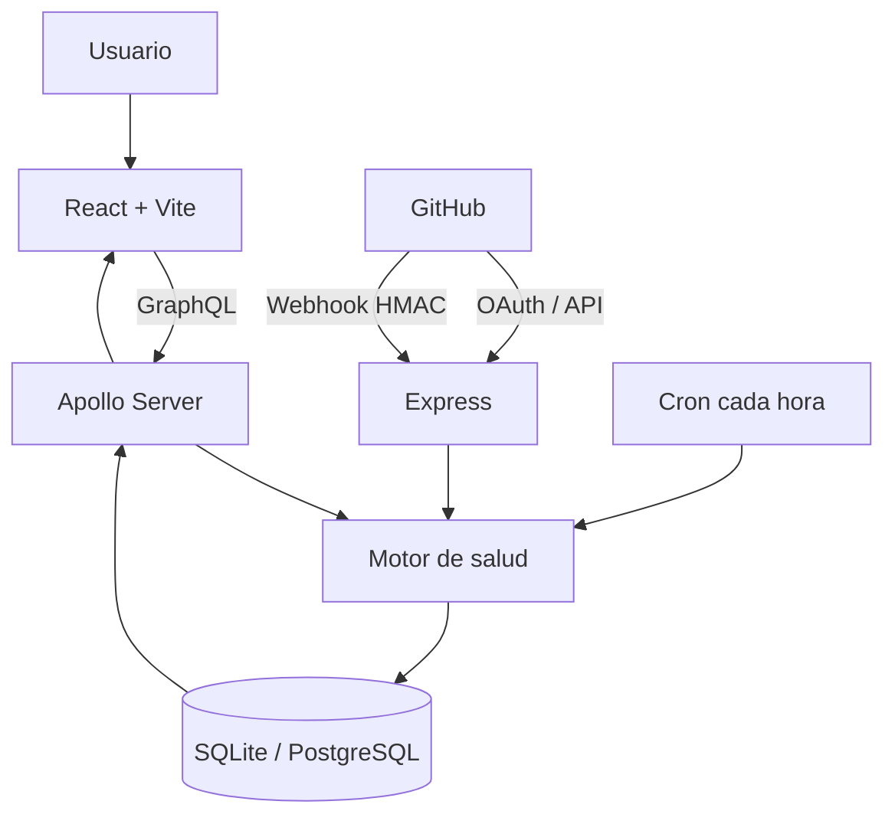

# Presentación técnica de DevGotchi

## 1. Problema

La salud de un repositorio está dispersa entre tests, pipelines, seguridad y configuración. Un equipo pequeño puede detectar tarde que su CI falla, que no existe cobertura o que se versionó un archivo sensible. Los paneles tradicionales presentan muchas métricas, pero no siempre comunican prioridad de forma inmediata.

## 2. Solución

DevGotchi reúne señales verificables de GitHub, las convierte en un diagnóstico con recomendaciones y representa el puntaje como la vida de una mascota. La interfaz permite conectar un repositorio, ejecutar un análisis, renombrar la mascota y revisar un informe técnico sin abandonar el flujo principal.

## 3. Qué es DevGotchi

Es una aplicación web monolítica educativa: React entrega la experiencia visual y un backend Node.js concentra API, reglas de negocio, integraciones y persistencia. La mascota no reemplaza las métricas; las resume y enlaza con un informe auditable.

## 4. Arquitectura monolítica

Todo el producto se versiona, prueba y entrega en un repositorio. El frontend y backend están separados por responsabilidades, pero pertenecen a una única solución y comparten contratos GraphQL, CI y documentación.



## 5. Tecnologías

- Frontend: React 19, TypeScript, Vite, Apollo Client, Vitest y Testing Library.
- Backend: Node.js 22, Express, Apollo Server, GraphQL, Jest y Supertest.
- Datos: SQLite para demo local y PostgreSQL para el entorno Docker.
- Operación: Docker, Docker Compose y GitHub Actions.

## 6. Flujo GitHub → backend → diagnóstico → base de datos → GraphQL → mascota

1. El usuario conecta una URL de GitHub desde React.
2. La mutación GraphQL normaliza y persiste el repositorio.
3. El backend consulta metadatos, árbol de archivos, workflows, ejecuciones y señales de seguridad disponibles.
4. El motor calcula checks, recomendaciones y puntaje.
5. El backend guarda análisis, fecha, vida y ánimo.
6. GraphQL devuelve el DevGotchi y el informe.
7. React actualiza mascota, barra de vida y recomendaciones.

## 7. Motor de salud

El análisis comprueba tests, configuración de coverage, GitHub Actions versionado, última ejecución, `.gitignore`, archivos de entorno rastreados y alertas de secretos/código cuando el token lo permite. Cada problema descuenta un impacto; el total queda limitado entre 0 y 100. La ausencia de permisos se muestra como “no verificable”, no como resultado saludable falso. El cron reanaliza proyectos activos cada hora y sincroniza la vida con evidencia nueva.

## 8. Testing y coverage

Jest prueba lógica de salud, repositorios, resolvers, rutas REST/GraphQL, adaptadores SQLite/PostgreSQL, inicialización, cron, OAuth con PKCE, cifrado y HMAC. Supertest recorre la aplicación Express real. Vitest prueba carga, error, conexión, actualización del análisis, renombrado e informe. `npm run test:coverage` falla si statements, branches, functions o lines bajan de 60%.

Evidencia reproducible:

```bash
npm --prefix backend run test:coverage
npm --prefix frontend test
npm --prefix frontend run lint
npm --prefix frontend run typecheck
npm --prefix frontend run build
```

## 9. Docker

`backend/Dockerfile` usa Node 22 Alpine, instala dependencias determinísticamente con `npm ci --omit=dev`, no copia secretos ni artefactos y ejecuta como usuario `node`. Compose levanta PostgreSQL con volumen y healthcheck; el backend espera a que esté saludable, se conecta por el nombre `postgres`, inicializa las tablas y publica el puerto 3000.

```bash
docker compose up --build
docker compose ps
curl http://127.0.0.1:3000/health
curl http://127.0.0.1:3000/estado-db
```

## 10. GitHub Actions

CI usa Node.js 22 y `npm ci`. Ambos jobs auditan las dependencias de producción. El job backend ejecuta tests y coverage con los cuatro umbrales. El job frontend ejecuta tests, ESLint, type-check y build. Los jobs no dependen de credenciales reales ni de la red de GitHub para sus casos de prueba.

## 11. Seguridad

- OAuth Authorization Code con state firmado y PKCE S256.
- Cookie temporal `HttpOnly` y `SameSite=Lax`.
- Tokens cifrados con AES-256-GCM usando una clave derivada de `SESSION_SECRET`.
- Webhooks autenticados con `X-Hub-Signature-256` y comparación segura.
- Deduplicación por `X-GitHub-Delivery`.
- CORS configurable y secretos excluidos por `.gitignore`/`.dockerignore`.
- El frontend nunca recibe client secret, session secret ni webhook secret.

## 12. Estado actual

Están implementados el diagnóstico real, cálculo de vida, informe, conexión/selección de repositorio, renombrado, reanálisis manual, cron, GraphQL, endpoints REST, SQLite, PostgreSQL, OAuth/PKCE, almacenamiento cifrado, webhooks firmados, demo local, Docker y CI. Las integraciones que necesitan credenciales se degradan de manera explícita y se prueban sin secretos reales.

## 13. Próximos pasos

- Mantener Apollo Server 5 y sus integraciones actualizados dentro de sus versiones soportadas.
- Sustituir el almacén de conexiones en archivo por un gestor de secretos o tabla cifrada administrada.
- Incorporar autenticación de usuarios y autorización por proyecto.
- Publicar reportes de coverage y una imagen versionada en un registry.
- Añadir pruebas end-to-end en navegador al pipeline.

## Orden recomendado para la demostración

1. Mostrar la estructura monolítica y el diagrama.
2. Ejecutar `npm run verify` y señalar coverage, tests, lint y build.
3. Ejecutar `docker compose up --build -d`.
4. Mostrar `docker compose ps`, `/health`, `/estado-db` y una consulta GraphQL.
5. Abrir `npm run demo`, conectar un repositorio público y actualizar el análisis.
6. Mostrar el informe, renombrar la mascota y explicar el cron.
7. Abrir `.github/workflows/ci.yml` y explicar los dos jobs.
8. Cerrar con seguridad, límites reales y próximos pasos.
